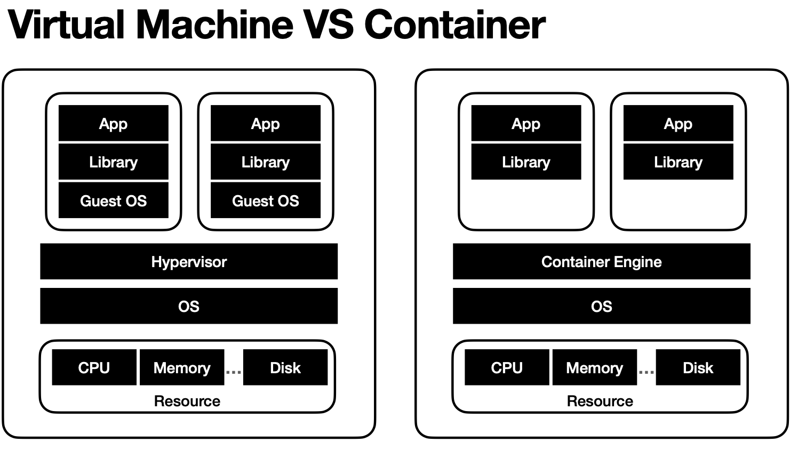
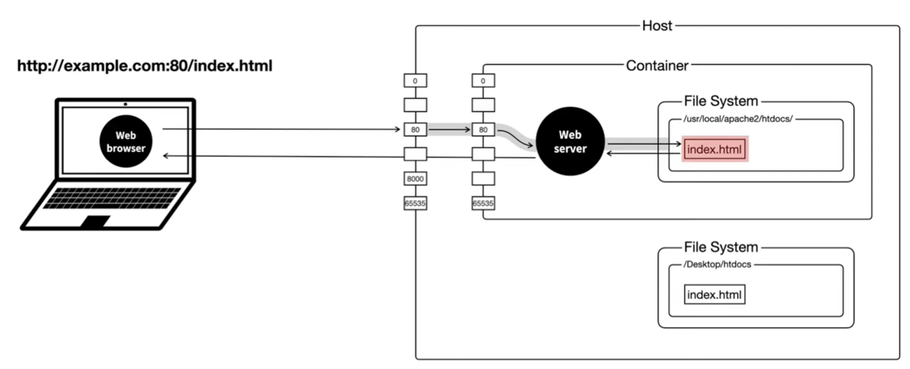

## What is Docker
***
### Intro 


To understand Docker, it is crucial to know about virtualization and container technology.

Initially, a single physical server ran applications. People then began to wonder, "Couldn't we make the resources work more efficiently?" This led to the creation of the Virtual Machine (VM). With VMs, you can run several applications on one physical server, each in a different environment.

However, running VMs requires a Guest Operating System (Guest OS) and a Hypervisor to facilitate communication between the Guest OS and the hardware. People started thinking again, "Couldn't we make the resources work more efficiently?"

This led to the development of container technology, which packages an application and its environment into a container. This is achieved with the use of virtualization technology, but containers are more lightweight than VMs because they share the host system’s kernel and do not need a full operating system for each application.

To implement container technology, certain properties of the Linux kernel are utilized :
- chroot : Isolation of File System
- namespace : Isolation of Process
- cgroup : Isolation of Hardware resource

<br>
*"Docker provides the ability to package and run an application in a loosely isolated environment called a container. The isolation and security lets you run many containers simultaneously on a given host. Containers are lightweight and contain everything needed to run the application, so you don't need to rely on what's installed on the host."* 
<br><br>

### Docker Architecture


- Docker Daemon : Listening for Docker API requests and manages Docker images, containers, networks, and volumes.
- Docker Client : Sending commands to dockerd(Docker daemon).
- Docker Desktop : A one-click-install application for your Mac, Linux, or Windows environment that lets you to build, share, and run containerized applications and microservices.
- Docker Registries : Storing Docker images (ex. Docker Hub).
- Docker Objects : 
  - Image - A read-only template with instructions for creating a Docker container.
  - Container - Runnable instance of an image.

<br>

[Docker overview | Docker Docs](https://docs.docker.com/get-started/overview/)
<br><br>

## Let's dive into it
***
### For Building and Running Your Own Docker Image
 1. Install Docker [Get Docker](https://docs.docker.com/get-docker/) <br><br>
 2. Create a Dockerfile
    ```dockerfile
    # Step 1. Set the base image
    FROM golang:alpine
    
    # Step 2. Set the working directory (Like the cd command)
    WORKDIR /app
    
    # Step 3. Copy the current directory contents into the container at /app (working directory)
    COPY . .
    
    # Step 4. Build the Go app when image is build
    RUN go build -o calculator .
    
    # Step 5. Run the program when the container is created
    CMD ["./calculator"]
    ```
    <br>
 3. Build the Image 
    ``` 
    docker build -t go-calculator .
    ```
    <br>
 4. Run a container from the image
    ``` 
    docker run go-calculator
    ```
    <br>
### For Pulling and Running Pre-Built Docker Images
 1. Install Docker <br><br>
 2. Pull an Image from a Registry
    ``` 
    docker pull httpd
    ```
    <br>
3. Run a container from the image
    ```
     docker run httpd
     docker run --name httpContainer httpd
    ```
   <br>
[DockerFile](https://docs.docker.com/engine/reference/builder/#from)

[Docker CLI](https://docs.docker.com/engine/reference/commandline/cli/)
<br><br>
## Docker Network, Volume and Compose
***
### Docker Network
Docker Network allows containers to communicate with each other and with the external world.


   ```
    docker network ls
   ```
- bridge : Default network driver. Use when the application runs in a container that needs to communicate with other containers on the same host.
- host : Use when the hosts's networking is direct.
- overlay : Use when communication is needed among containers of different host.
  <br><br>

### Docker Volume
Docker Volume is used to manage persistent data storage for Docker containers.

 <br><br>


### Docker compose 
Docker Compose is primarily used to define and manage multi-container Docker applications. Each service in your application can be defined in the Compose file, making it easy to manage complex applications with multiple interdependent containers. (Translated to CLI)
```
version: 

services:
  name:
    build: 
    image:
    restart:
    ports:
    environment:
    volimes:
    networks:
```
- services : Define a container information, which can be used to create and manage a container. (name, image, port mapping, env setting, volume, etc.)<br><br>
```
docker-compose -f infra.yml up -d
```
- up : Create a container with the compose file
- -f : Set the compose file
- -d : Run in background <br><br>

[Docker Network Drivers](https://docs.docker.com/network/drivers/)

[Docker Volume](https://docs.docker.com/storage/volumes/)

[Docker Compose](https://docs.docker.com/compose/compose-file/)
<br><br>
## Let's dive into it
***
### Manage containers with Docker CLI
### Manage containers with Docker compose file