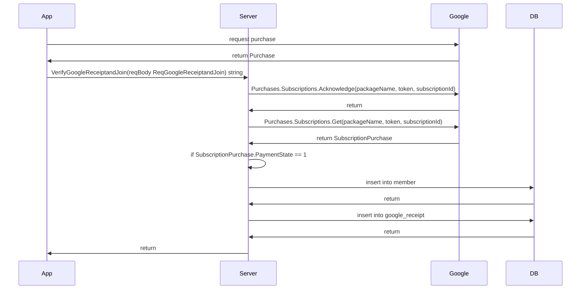

## Google Play API & RTDN
***
### Intro 

**Google Cloud Platform & Google Play Console**
1. Create a Project and connect it to Google Play Console.
2. Create a Service Account and download the JSON key in GCP.
   - This key is required when making authenticated calls to the Google Play Developer API.
3. Enable the Google Play Android Developer API
4. Set the necessary permissions in the Google Play Console to allow the service account to view financial data and manage orders.

**RTDN (RealTime Developer Notification)**
1. Create a Pub/Sub topic in Google Cloud Console. (Publish pub/sub)
2. Implement the server to receive and handle the RTDN message. (Subscribe pub/sub)

### Setup
1. Create an account and publish the app. [Getting ready](https://developer.android.com/google/play/billing/getting-ready)
2. Create and manage subscriptions. [Play Console Help](https://support.google.com/googleplay/android-developer/answer/140504?hl=en&;ref_topic=3452890)
3. Set the Google Play Developer API. [Getting Started](https://developers.google.com/android-publisher/getting_started)
4. Set the RTDN. [RTDN](https://developer.android.com/google/play/billing/getting-ready)
5. Implement the server.
6. Test

<br>

## Implement
***

[Purchase](https://developer.android.com/reference/com/android/billingclient/api/Purchase)

[SubscriptionPurchase](https://developers.google.com/android-publisher/api-ref/rest/v3/purchases.subscriptions)

### Access to Google Play API
```go

type Service struct {
   ...
     GoogleAPI       *androidpublisher.Service
     PackageName     string
     SubscriptionID  string
}

func (_this Service) AccessToGoogleAPI() {
   
   // Store the ket securely!!! My code is just an example to show how it's working briefly.
   GoogleAPIKey = "/my/secret/google-api/jsonkey.json"
   ctx := context.Background()
   jsonKey, err := ioutil.ReadFile(GoogleAPIKey)
   if err != nil {
     // handle the error
   } 
   
   // Create the JWT config instance
   config, err := google.JWTConfigFromJSON(jsonKey, androidpublisher.AndroidpublisherScope)
   if err != nil {
     // handle the error
   } 
   
   // Create the authenticated HTTP client
   // - Got the access token from JWT config
   client := config.Client(ctx)
   
   // Create the Android Publisher service instance
   // - It offer methods to be able to communicate with Google Plau API
   GoogleAPI, err := androidpublisher.NewService(ctx, option.WithHTTPClient(client))
   if err != nil {
     // handle the error
   } 
   
   _this.GoogleAPI = GoogleAPI   
   
   return _this
}

```

[google package](https://pkg.go.dev/golang.org/x/oauth2/google#JWTConfigFromJSON) |
[androidpublisher package](https://pkg.go.dev/google.golang.org/api/androidpublisher/v2#Service) 


### Verify the receipt and join member
```go
func (_this *HttpService) verifyGoogleReceipt(PNumber string, reqBody formats.ReqGoogleRequest) error {
	
	/** 영수증 검증 **/

	err := util.AcknowledgeSubscription(_this.Fac, reqBody.PurchaseToken)
	if err != nil {
		_this.Fac.Print("Payment is not acknowledged.")
		return err
	}

	respSub, err := util.GetSubscription(_this.Fac, reqBody.PurchaseToken)
	if err != nil {
		_this.Fac.Print("failed to get subscription.")
	}

	if respSub.AcknowledgementState != 1 {
		_this.Fac.Print("Payment is not acknowledged.")
		return err
	}

	if respSub.PaymentState == nil {
		_this.Fac.Print("payment state is nil")
		return err
	}

	switch *respSub.PaymentState {
	case 0:
		_this.Fac.Print("payment is pending")
		return err
	case 1:
		_this.Fac.Print("Payment is received.")
	default:
		_this.Fac.Print("unknown payment state")
		return err
	}
	
	/** 영수증 저장 **/
	...

}
```

```go
func AcknowledgeSubscription(Fac *factory.Factory, token string) error {

	call := Fac.GoogleAPI.Purchases.Subscriptions.Acknowledge(Fac.Propertys().PackageName, Fac.Propertys().SubscriptionID, token, &androidpublisher.SubscriptionPurchasesAcknowledgeRequest{})

	err := call.Do()
	if err != nil {
		return err
	}

	return nil
}

func GetSubscription(Fac *factory.Factory, token string) (androidpublisher.SubscriptionPurchase, error) {

	respSub := androidpublisher.SubscriptionPurchase{}

	call := Fac.GoogleAPI.Purchases.Subscriptions.Get(Fac.Propertys().PackageName, Fac.Propertys().SubscriptionID, token)
	resp, err := call.Do()
	if err != nil {
		return respSub, err
	}

	jsonByte, err := json.Marshal(resp)
	if err != nil {
		return respSub, err
	}

	err = json.Unmarshal(jsonByte, &respSub)
	if err != nil {
		return respSub, err
	}

	Fac.Print(token, respSub)

	return respSub, nil
}
```

### RTDN 
```go
func ReceiveRTDN(fac *factory.Factory, handler *Handler) {
	fmt.Println("rtdn connected")
	ctx := context.Background()

	projectID := "secret"
	subscriptionID := "secret"

	os.Setenv("GOOGLE_APPLICATION_CREDENTIALS", GoogleAPIKey)

	client, err := pubsub.NewClient(ctx, projectID)
	if err != nil {
		fmt.Printf("Failed to create client: %v\n", err)
		return
	}

	sub := client.Subscription(subscriptionID)

	err = sub.Receive(ctx, func(ctx context.Context, msg *pubsub.Message) {

		devNotif := playstore.DeveloperNotification{}

		err := json.Unmarshal(msg.Data, &devNotif)
		fmt.Printf("Parsed Notification: %+v\n", devNotif)
		if err != nil {
			msg.Nack()
			fmt.Printf("Failed to unmarshal message: %v\n", err)
			return
		}

		notif := devNotif.SubscriptionNotification
		fmt.Printf("Parsed Notification: %+v\n", notif)
		
		handler.HandleNotification(devNotif.SubscriptionNotification)
		msg.Ack()
	})
	if err != nil {
		fmt.Printf("Failed to receive message: %v\n", err)
	}
}
```
```go
func (_this *Handler) HandleNotification(notif playstore.SubscriptionNotification) {

	token := notif.PurchaseToken
	notiType := notif.NotificationType

	respSub, err := util.GetSubscription(_this.Fac, token)
		if err != nil {
			fmt.Println(respSub)
			fmt.Println("Failed to get respSub")
			return
		}

	switch notiType {
	case playstore.SubscriptionNotificationTypeRenewed:	
	case playstore.SubscriptionNotificationTypeCanceled:	
	case playstore.SubscriptionNotificationTypeRestarted:	
	case playstore.SubscriptionNotificationTypeGracePeriod:	
	case playstore.SubscriptionNotificationTypeAccountHold:	
	case playstore.SubscriptionNotificationTypeRecovered:	
	case playstore.SubscriptionNotificationTypePaused:	
	case playstore.SubscriptionNotificationTypePauseScheduleChanged:	
	case playstore.SubscriptionNotificationTypeDeferred:
	case playstore.SubscriptionNotificationTypeRevoked:
	case playstore.SubscriptionNotificationTypeExpired:
	}

	return
}

```
[playstore package](https://pkg.go.dev/github.com/awa/go-iap/playstore#New)|
[pubsub package](https://pkg.go.dev/cloud.google.com/go/pubsub)